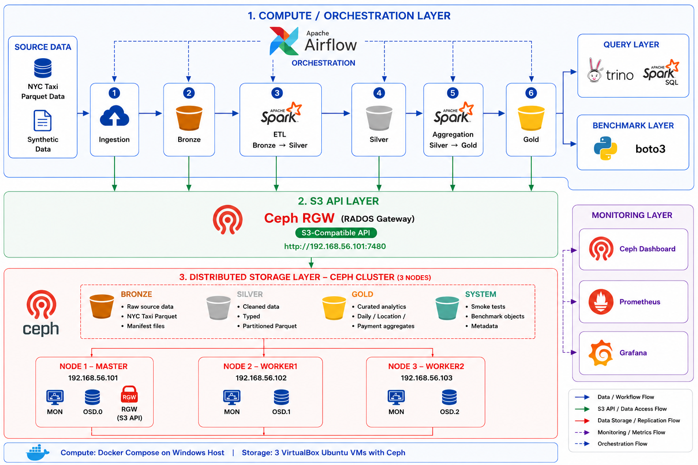

<div align="center">

# Ceph-based Data Lake with Optimized Data Pipelines

<p>
  <b>Distributed Data Lake on Ceph Object Storage</b><br/>
  Bronze/Silver/Gold data pipeline with Spark, Trino, Airflow, and S3-compatible storage benchmarking.
</p>

<p>
  
  
  
  
  
</p>

</div>

---

## Overview

This repository implements a Data Lake architecture that uses **Ceph Object Storage** as the S3-compatible storage layer for ingestion, transformation, querying, and storage benchmarking.

Ceph RGW is the target object storage backend. MinIO is kept as a lightweight local baseline for development and comparison.

<div align="center">
  <a href="docs/architecture.png">
    
  </a>
  <br/>
  <sub><b>Architecture overview:</b> Airflow orchestration, Spark ETL, Trino/Spark SQL analytics, Ceph RGW S3 API, Bronze/Silver/Gold buckets, monitoring, and fault-tolerant Ceph storage.</sub>
</div>

## What This Project Demonstrates

<table>
  <tr>
    <td><b>Ceph as Data Lake Storage</b></td>
    <td>Ceph RGW provides the S3-compatible storage backbone for bronze, silver, gold, and system buckets.</td>
  </tr>
  <tr>
    <td><b>Distributed Pipeline</b></td>
    <td>Python ingestion and Spark jobs transform NYC Taxi data from raw bronze files into cleaned silver and curated gold Parquet outputs.</td>
  </tr>
  <tr>
    <td><b>Analytics on Object Storage</b></td>
    <td>Trino and Spark SQL query Ceph-backed Parquet data directly through the S3-compatible API.</td>
  </tr>
  <tr>
    <td><b>Fault Tolerance</b></td>
    <td>A Ceph worker node can be shut down while Trino still queries gold data through RGW; Ceph later recovers to <code>HEALTH_OK</code>.</td>
  </tr>
  <tr>
    <td><b>Benchmarking</b></td>
    <td>A boto3 runner measures S3 PUT/GET/mixed workloads and compares the local MinIO baseline with the Ceph RGW lab.</td>
  </tr>
</table>

## Highlights

- Ceph RGW backed by a 3-node Ceph lab cluster.
- CephFS and RBD mini demos to show Ceph file and block storage capabilities beyond S3.
- S3-compatible bronze, silver, gold, and system buckets.
- NYC Taxi and synthetic data sources.
- Manifest-based bronze ingestion.
- Spark bronze-to-silver cleansing and silver-to-gold aggregations.
- Spark SQL and Trino query checks over Ceph-backed Parquet data.
- Docker Compose runtime for Spark, Airflow, Trino, MinIO, Prometheus, and Grafana.
- Boto3-based S3 storage benchmark runner.
- Fault-tolerance demo: one Ceph worker node down while Trino still queries gold data through RGW.

## Architecture

The validated Ceph lab uses three VirtualBox Ubuntu VMs:

| Host | IP | Role |
|---|---|---|
| `hadoop-master` | `192.168.56.101` | Ceph host, MON, OSD.0, RGW endpoint |
| `hadoop-worker1` | `192.168.56.102` | Ceph host, MON, OSD.1 |
| `hadoop-worker2` | `192.168.56.103` | Ceph host, MON, OSD.2 |

Ceph provides the storage layer:

- Ceph version: `18.2.8 reef`
- Deployment: `cephadm`
- MON quorum: 3 MONs
- OSD layout: 3 OSDs, one virtual disk per VM
- RGW endpoint: `http://192.168.56.101:7480`

Docker Compose on the Windows host provides the compute and application layer:

- Spark standalone for ETL and Spark SQL jobs
- Trino for SQL analytics over gold Parquet data
- Airflow for orchestration
- Prometheus/Grafana for local monitoring experiments
- MinIO for local S3-compatible development and baseline runs

The S3 endpoint is configured through `.env`, so the same pipeline can point to MinIO or Ceph RGW without code changes.

## Repository Layout

```text
airflow/            Airflow DAGs
benchmark/          Storage and query benchmark runners
data/               Local source data and generated inputs
docker/             Docker Compose, Spark, Trino, Airflow, monitoring config
docs/               Technical documentation, validation notes, runbooks
generator/          Synthetic tabular and binary data generators
ingestion/          Manifest generation and bronze upload utilities
infrastructure/     Bucket, S3, and config helpers
results/            Local pipeline metrics and query outputs
spark/              PySpark jobs and shared Spark helpers
tests/              Unit tests
```

## Prerequisites

Required for local development:

- Python 3.11+
- Docker Desktop or Docker Engine with Compose v2
- GNU Make
- Git
- An NYC Taxi Parquet file, for example `data/source/nyc-taxi/yellow_tripdata_2025-01.parquet`

Required for Ceph validation:

- A reachable Ceph RGW endpoint
- S3 access key and secret key for an RGW user
- Network access from the host and Docker containers to the RGW endpoint

## Configuration

Create a local environment file:

```powershell
Copy-Item .env.example .env
```

For a Ceph RGW run, set the S3 values in `.env`:

```env
S3_ENDPOINT=http://192.168.56.101:7480
S3_ACCESS_KEY=<your-rgw-access-key>
S3_SECRET_KEY=<your-rgw-secret-key>
S3_REGION=us-east-1
S3_PATH_STYLE_ACCESS=true
S3_USE_SSL=false
BRONZE_BUCKET=datalake-bronze
SILVER_BUCKET=datalake-silver
GOLD_BUCKET=datalake-gold
SYSTEM_BUCKET=datalake-system
```

If your Windows environment has a global proxy, make sure local Ceph VM addresses bypass it:

```env
NO_PROXY=localhost,127.0.0.1,192.168.56.101,192.168.56.102,192.168.56.103
no_proxy=localhost,127.0.0.1,192.168.56.101,192.168.56.102,192.168.56.103
```

Do not commit `.env`; it may contain real credentials.

## Install

Install Python dependencies:

```powershell
pip install -r requirements.txt
```

Run syntax and unit checks:

```powershell
make test
```

Validate required environment variables:

```powershell
make config-check
```

## S3 Bucket Checks

Check the configured S3-compatible endpoint:

```powershell
make health
```

Create the Data Lake buckets if needed:

```powershell
make init-buckets
```

Run upload/download/checksum/delete smoke validation:

```powershell
make storage-smoke
```

## Data Ingestion

Prepare the default NYC Taxi manifest:

```powershell
make prepare-nyc-taxi
```

Upload manifest-described files into the bronze bucket:

```powershell
make ingest
```

Default input:

```text
data/source/nyc-taxi/yellow_tripdata_2025-01.parquet
```

Default bronze location:

```text
s3://datalake-bronze/nyc-taxi/year=2025/month=01/yellow_tripdata_2025-01.parquet
```

## Spark ETL

For low-memory machines, start only the Spark services before running ETL:

```powershell
make spark-up
```

Run bronze-to-silver:

```powershell
make spark-submit-silver
```

Run silver-to-gold:

```powershell
make spark-submit-gold
```

Output locations:

```text
s3://datalake-silver/nyc-taxi/year=2025/month=01
s3://datalake-gold/daily_trip_metrics/year=2025/month=01
s3://datalake-gold/location_metrics/year=2025/month=01
s3://datalake-gold/payment_metrics/year=2025/month=01
```

Stop Spark when finished:

```powershell
make spark-down
```

## Query Validation

Run Spark SQL smoke queries:

```powershell
make query-smoke
```

Run Trino against the Ceph-backed gold tables:

```powershell
make trino-up
make trino-smoke
make trino-down
```

The Trino UI is available while Trino is running:

```text
http://localhost:8083/ui/
```

## Airflow Orchestration

The Airflow DAG orchestrates the same building blocks:

```text
check_config -> check_storage -> prepare_manifest -> upload_bronze
             -> bronze_to_silver -> silver_to_gold
```

Start Airflow with Spark services:

```powershell
make airflow-up
make airflow-dag-list
```

Open the UI:

```text
http://localhost:8080
```

Stop Airflow services:

```powershell
make airflow-down
```

On memory-constrained machines, prefer validating the task commands individually instead of running Airflow, Spark, Trino, and monitoring together.

## Storage Benchmark

Run the default S3-compatible benchmark:

```powershell
make benchmark-storage
```

Example Ceph RGW baseline run:

```powershell
make benchmark-storage BENCHMARK_RUN_ID=ceph-3vm-baseline STORAGE_BENCHMARK_BACKEND=ceph-rgw STORAGE_BENCHMARK_OBJECT_SIZES=1MiB STORAGE_BENCHMARK_CONCURRENCY=1,4 STORAGE_BENCHMARK_OPERATIONS=put,get,mixed STORAGE_BENCHMARK_WARMUP=1 STORAGE_BENCHMARK_ITERATIONS=3
```

Results are written under:

```text
benchmark/results/<run-id>/storage/s3/<timestamp>/
```

## Fault-Tolerance Demo

The key Ceph demo is a controlled single-node outage:

1. Start from `HEALTH_OK`.
2. Query gold data with Trino.
3. Gracefully shut down `hadoop-worker2`.
4. Confirm Ceph reports `HEALTH_WARN`, `osd.2 down`, and degraded redundancy.
5. Run `make trino-smoke` again.
6. Confirm Trino still returns gold data from Ceph RGW.
7. Run `make health` and `make storage-smoke`.
8. Restart `hadoop-worker2`.
9. Confirm Ceph recovers to `HEALTH_OK`.

This demonstrates that Ceph remains usable for read-side analytics while one storage node is unavailable, although redundancy is temporarily reduced.

## Monitoring

Start the local monitoring stack:

```powershell
make monitoring-up
```

Endpoints:

```text
Prometheus: http://localhost:9090
Grafana:    http://localhost:3000
```

Stop monitoring:

```powershell
make monitoring-down
```

The repo monitoring stack is mainly for the Docker-based application runtime. Ceph also exposes its own dashboard and Prometheus endpoint through the Ceph manager.

## Documentation

<table>
  <tr>
    <td><a href="docs/ceph-positioning.md"><b>Ceph Positioning</b></a></td>
    <td>Why Ceph, when to use it, and how to explain Ceph vs MinIO.</td>
  </tr>
  <tr>
    <td><a href="docs/ceph-rgw-validation.md"><b>Ceph RGW Validation</b></a></td>
    <td>Validation results, including Trino query during node outage.</td>
  </tr>
  <tr>
    <td><a href="docs/cephfs-rbd-demo.md"><b>CephFS and RBD Demo</b></a></td>
    <td>Ceph file storage and block storage demos beyond the RGW/S3 path.</td>
  </tr>
  <tr>
    <td><a href="docs/ceph-transition-summary.md"><b>Transition Summary</b></a></td>
    <td>Summary of moving from MinIO-only local storage to Ceph RGW.</td>
  </tr>
  <tr>
    <td><a href="docs/storage-backend-comparison.md"><b>Storage Backend Comparison</b></a></td>
    <td>MinIO vs Ceph RGW lab benchmark interpretation.</td>
  </tr>
  <tr>
    <td><a href="docs/datasets.md"><b>Datasets</b></a></td>
    <td>Dataset paths, source files, and manifest format.</td>
  </tr>
  <tr>
    <td><a href="docs/nyc-taxi-scale-validation.md"><b>NYC Taxi Scale Validation</b></a></td>
    <td>Multi-file real NYC Taxi scale run on Ceph RGW with Spark ETL and query metrics.</td>
  </tr>
  <tr>
    <td><a href="docs/query.md"><b>Query Layer</b></a></td>
    <td>Spark SQL and Trino query usage.</td>
  </tr>
</table>

## Current Validation Summary

<table>
  <tr><th>Area</th><th>Result</th></tr>
  <tr><td>S3 health check</td><td>Passed</td></tr>
  <tr><td>S3 storage smoke</td><td>Passed</td></tr>
  <tr><td>Bronze upload</td><td>Passed</td></tr>
  <tr><td>Spark bronze-to-silver</td><td>Passed</td></tr>
  <tr><td>Spark silver-to-gold</td><td>Passed</td></tr>
  <tr><td>Spark SQL query smoke</td><td>Passed</td></tr>
  <tr><td>NYC Taxi multi-file scale run</td><td>Passed with 6 real files, 19,493,620 input rows</td></tr>
  <tr><td>Trino gold query smoke</td><td>Passed</td></tr>
  <tr><td>Trino query during one-node outage</td><td>Passed</td></tr>
  <tr><td>Ceph recovery after node restart</td><td>Returned to <code>HEALTH_OK</code></td></tr>
  <tr><td>CephFS shared filesystem demo</td><td>Passed</td></tr>
  <tr><td>RBD block storage demo</td><td>Passed</td></tr>
</table>

The benchmark results are lab baselines, not production performance claims. MinIO is faster in the local laptop benchmark, while Ceph demonstrates the distributed storage behavior: replication, degraded operation, and recovery.

## Operational Notes

- Keep `.env` local and uncommitted.
- Start only the services needed for the current validation step.
- Avoid running Airflow, Spark, Trino, Prometheus, and Grafana all at once on memory-constrained machines.
- Check Ceph health before running pipeline or benchmark commands:

```bash
sudo cephadm shell -- ceph -s
```

- After a VM reboot or host sleep, wait for Ceph to return to `HEALTH_OK` before running performance-sensitive tests.
